# Namer 战斗系统时序图汇总

本文档汇总了 Namer 游戏中战斗系统的所有主要时序流程，基于实际源码分析和验证。这些时序图描述了从单位行动、技能释放到伤害结算、死亡处理的完整调用链。

## 概述

Namer 的战斗系统核心建立在以下关键方法之上：

- `attacked(atp, isMag, caster, ondmg, r, updates)` - 标准攻击入口
- `defend(atp, isMag, caster, ondmg, r, updates)` - 防御与伤害计算
- `damage(dmg, caster, ondmg, r, updates)` - 实际伤害应用
- `onDamaged(dmg, oldhp, caster, r, updates)` - 伤害后处理
- `onDie(oldhp, caster, r, updates)` - 死亡处理

系统支持多种特殊攻击路径，这些路径会跳过部分标准流程。理解这些分支对于准确复现行为至关重要。

## 完整时序图

```mermaid
sequenceDiagram
    box rgb(60,60,60) 1. 回合入口
        participant C  as Controller
        participant P  as Plr (玩家/怪物)
    end
    box rgb(50,70,100) 2. 行动前与选择
        participant Pre as PreActions (前置)
        participant Act as Actions (行动)
    end
    box rgb(50,90,50) 3. 技能生效
        participant S  as Skill (技能)
    end
    box rgb(100,70,40) 4. 目标受击与防御/伤害链
        participant T  as PlrTarget (目标)
        participant G  as Grp (队伍)
        participant O  as Owner (召唤者)
    end
    box rgb(100,50,50) 5. 日志与终局检查
        participant R  as RunUpdates (日志)
    end

    %% 1. 回合入口
    C->>+P: step()
    P->>P: spsum += r.r3() (累积速度值)
    alt spsum < 2048 (未达阈值)
        P-->>C: 返回
    else spsum >= 2048 (可行动)
        P->>P: spsum = 0
        P->>P: action()
    end

    %% 2. 行动前摇 / 技能选择
    P->>+Pre: 执行 preAction 词条 (武器/Boss/技能可能修改)
    Pre-->>P: 返回可能强制选定的技能
    alt 未强制选定技能
        P->>Act: 选择 ActionSkill (检查MP, 权重, 随机数)
        Act-->>P: 返回选定技能
    end
    P->>-S: act(targets, smart, r, updates)

    %% 3. 技能生效（对每个目标）
    loop 遍历所有目标 (tgt)
        S->>S: 计算 atp (Alg.getAt / 法术标记 / 是否魔法)
        note right of S: 特例：Heal 等技能会直接修改 `hp`（不经过 attacked/defend）
        note right of S: 特例：Explode 等会直接把自己置为 0 并调用 `onDie`

        alt 路径 1: 标准攻击流程（最常见）
            S->>+T: attacked(atp, is_mag, caster, ondmg, r, updates)
            T->>T: preDefend(atp, is_mag, caster, ondmg, r, updates)
            note right of T: 遍历 predefends 列表，修改 atp 或产生副作用
            
            alt predefend 返回 atp == 0
                T->>R: push RunUpdate (反弹或无效化)
                T-->>S: return 0
            else 继续流程
                T->>T: Alg.dodge(accure, dodgeval, r)
                alt 闪避成功
                    T->>R: push RunUpdate.dodge
                    T-->>S: return 0
                else 未闪避
                    T->>T: defend(atp, is_mag, caster, ondmg, r, updates)
                    T->>T: Alg.getDf() -> 计算基础伤害
                    T->>T: postDefend(dmg, caster, ondmg, r, updates)
                    note right of T: 遍历 postdefends 列表，修改最终伤害
                    T->>R: push RunUpdate.damage
                    T->>T: damage(dmg, caster, ondmg, r, updates)
                    T->>T: hp -= dmg
                    T->>T: ondmg(caster, this, dmg, r, updates)
                    T->>T: onDamaged(dmg, oldhp, caster, r, updates)
                    note right of T: 遍历 postdamages 列表
                    
                    alt hp <= 0
                        T->>T: onDie(oldhp, caster, r, updates)
                        T->>R: push RunUpdate.die
                        T->>T: 遍历 dies 列表
                        alt dies 中触发复活
                            T->>T: hp = new_value (> 0)
                            T->>G: revive(this)
                        end
                        T->>G: die()
                        G->>C: checkWin()
                        alt caster 存活
                            T->>caster: caster.kill(this, r, updates)
                            note right of caster: 遍历 caster 的 kills 列表
                        end
                    end
                end
                T-->>-S: return
            end

        else 路径 2: 直接调用 `defend(...)`（跳过 preDefend 与 dodge）
            note right of T: 触发示例: `disperse`, `assassinate`, `thunder`, `ikaruga` 等
            S->>+T: defend(atp, is_mag, caster, ondmg, r, updates)
            T->>T: Alg.getDf() -> calc dmg
            T->>T: postDefend(dmg, caster, ondmg, r, updates)
            T->>R: push RunUpdate.damage
            T->>T: damage(dmg, caster, ondmg, r, updates)
            T->>T: onDamaged(dmg, oldhp, caster, r, updates)
            alt hp <= 0
                T->>T: onDie(oldhp, caster, r, updates)
                T->>G: die()
                G->>C: checkWin()
            end
            T-->>-S: return

        else 路径 3: 直接修改 `hp`（绕过攻击链）
            note right of S: 触发示例: `revive`, `clone`, `half`, `reraise` 等
            S->>+T: T.hp = new_value
            alt hp > 0
                T->>T: updateStates()
                T->>R: push RunUpdate (hp change)
            else hp <= 0
                T->>T: onDie(oldhp, caster, r, updates)
                T->>G: die()
                G->>C: checkWin()
            end
            T-->>-S: return

        else 路径 4: 直接调用 `onDie(...)`（自爆/立即死亡）
            note right of S: 触发示例: `shadow`, `summon` 自爆等
            S->>+T: T.hp = 0
            S->>T: T.onDie(oldhp, caster, r, updates)
            T->>R: push RunUpdate.die
            T->>T: 遍历 dies 列表
            alt dies 中生成子体/分裂
                T->>G: spawn children
            end
            T->>G: die()
            G->>C: checkWin()
            T-->>-S: return

        else 路径 5: 召唤物伤害共享 / 伤害转移
            note right of T: 触发示例: `PlrSummon.postDamage`
            S->>+SUM: attacked/defend/damage (summon 受伤)
            SUM->>SUM: 执行标准或直接 defend 流程
            SUM->>R: push RunUpdate.damage (summon)
            SUM->>SUM: onDamaged(dmg, oldhp, caster, r, updates)
            SUM->>SUM: 遍历 postdamages 列表
            note right of SUM: postDamage 中向 owner 转移一半伤害
            SUM->>O: owner.damage(dmg ~/ 2, is_mag, caster, ondmg, r, updates)
            O->>O: hp -= dmg_share
            O->>R: push RunUpdate.damage (owner)
            O->>O: onDamaged(dmg_share, oldhp_owner, caster, r, updates)
            alt owner.hp <= 0
                O->>O: onDie(oldhp_owner, caster, r, updates)
                O->>G: die()
                G->>C: checkWin()
            end
            SUM-->>-S: return
        end
    end

    %% 5. 日志与胜负
    S-->>C: 返回 updates (日志列表)
    C->>R: broadcast(updates)
    alt checkWin() == true
        C->>C: 触发 GAME_OVER 事件
    end
```



## 各路径详细说明

### 路径 1: 标准攻击流程

**触发条件**: 通过 `target.attacked(...)` 调用的普通攻击

**调用链**:
```D:/githubs/namer/namer-src/plr.dart#L466-493
int attacked(double atp, bool isMag, Plr caster, OnDamage ondmg, R r, RunUpdates updates) {
  atp = preDefend(atp, isMag, caster, ondmg, r, updates);
  if (atp == 0.0) return 0;
  
  // 闪避判定
  if (active && Alg.dodge(accure, dodgeval, r)) {
    updates.add(new RunUpdate(..., 'dodge', ...));
    return 0;
  }
  
  return defend(atp, isMag, caster, ondmg, r, updates);
}
```

**特点**:
- 执行所有 `predefends` 回调
- 进行闪避判定
- 闪避成功则不造成伤害
- 闪避失败进入 `defend` 流程

**典型技能**: 大部分普通攻击技能，如 `berserk.dart`, `fire.dart`, `ice.dart` 等

---

### 路径 2: 直接调用 `defend(...)`

**触发条件**: 某些技能直接调用 `target.defend(...)`，跳过 `preDefend` 和闪避

**调用链**:
```D:/githubs/namer/namer-src/plr.dart#L489-493
int defend(double atp, bool isMag, Plr caster, OnDamage ondmg, R r, RunUpdates updates) {
  num dfp = Alg.getDf(this, isMag, r);
  int dmg = (atp / dfp).ceil();
  dmg = postDefend(dmg, caster, ondmg, r, updates);
  return damage(dmg, caster, ondmg, r, updates);
}
```

**特点**:
- **跳过** `predefends` 列表
- **跳过** 闪避判定
- 仍然执行 `postDefends`、`postdamages`、`onDamaged`、`onDie`

**触发位置**:
```D:/githubs/namer/namer-src/act/assassinate.dart#L71-75
saveTarget.defend(atp, true, owner, Skill.onDamage, r, updates);
```

```D:/githubs/namer/namer-src/act/disperse.dart#L51-57
if (target is Minion) {
  atp *= 2.0;
  target.defend(atp, true, owner, onDamage, r, updates);
} else {
  target.defend(atp, true, owner, onDamage, r, updates);
}
```

```D:/githubs/namer/namer-src/act/thunder.dart#L24-28
target.defend(atp, true, owner, onDamage, r, updates);
```

```D:/githubs/namer/namer-src/boss/ikaruga.dart#L59-63
target.defend(atp, true, owner, Skill.onDamage, r, updates);
```

---

### 路径 3: 直接修改 `hp`

**触发条件**: 技能直接对目标 `hp` 赋值或修改

**特点**:
- **完全绕过** `attacked`、`defend`、`damage` 链
- **不触发** `predefends`、`postdefends`、`postdamages` 等攻击链回调
- 如果 `hp <= 0`，仍然会触发 `onDie` 和 `dies` 列表

**触发位置**:
```D:/githubs/namer/namer-src/act/revive.dart
// 复活类技能直接设置 hp
target.hp = new_value;
target.updateStates();
```

```D:/githubs/namer/namer-src/act/clone.dart
// 生成新单位并设置 hp
newPlr.hp = hp;
```

```D:/githubs/namer/namer-src/act/half.dart#L45-52
// 将 hp 减半
int damaged = oldhp - target.hp;
if (damaged > 0) {
  target.onDamaged(damaged, oldhp, owner, r, updates);
}
```

```D:/githubs/namer/namer-src/skl/reraise.dart
// 死亡复活逻辑中直接修改 hp
```

---

### 路径 4: 直接调用 `onDie(...)`

**触发条件**: 自爆、强制死亡等技能直接触发死亡处理

**特点**:
- **跳过** 所有攻击、防御、伤害计算逻辑
- 直接进入死亡处理：`dies` 列表 -> `Grp.die` -> `caster.kill`
- 可能触发复活、生成子体、分裂等副作用

**调用链**:
```D:/githubs/namer/namer-src/plr.dart#L555-569
void onDie(int oldhp, Plr caster, R r, RunUpdates updates) {
  updates.add(RunUpdate.newline);
  updates.add(new RunUpdate(getDieMessage(), caster, new DPlr(this), null, null, 50));
  
  for (DieEntry entry in dies) {
    if (entry.die(oldhp, caster, r, updates)) {
      break;
    }
  }
  
  if (hp > 0) return; // dies 中可能复活
  
  group.die(this);
  
  if (caster != null && caster.alive) {
    caster.kill(this, r, updates);
  }
}
```

**触发位置**:
```D:/githubs/namer/namer-src/act/shadow.dart
// 幻影自爆技能
```

```D:/githubs/namer/namer-src/act/summon.dart
// SklExplode 自爆技能
caster.hp = 0;
caster.onDie(oldhp, caster, r, updates);
```

---

### 路径 5: 召唤物伤害共享

**触发条件**: 召唤物（PlrSummon）被攻击后，将部分伤害转移给召唤者（owner）

**特点**:
- 召唤物先走标准攻击流程（或直接 defend）
- 在召唤物的 `postDamage` 中，调用 `owner.damage()` 分摊伤害
- 分摊伤害会触发 owner 的完整伤害链：`damage` -> `onDamaged` -> `postdamages` -> `onDie`（如需）

**调用链**:
```D:/githubs/namer/namer-src/act/summon.dart (PlrSummon.postDamage)
void postDamage(int dmg, Plr caster, R r, RunUpdates updates) {
  if (owner.alive) {
    int dmgShare = dmg ~/ 2;
    owner.damage(dmgShare, is_mag, caster, ondmg, r, updates);
  }
}
```

**事件顺序**:
1. 召唤物受击 → 召唤物 `onDamaged` → 召唤物 `postdamages` 列表遍历
2. 触发 `PlrSummon.postDamage`
3. 调用 `owner.damage(dmg ~/ 2, ...)` → owner `onDamaged` → owner `postdamages` 列表遍历

**注意**: 这个跨对象调用会改变事件的发生顺序和写入目标（owner.hp），在重写时需要确保这些路径被单独测试。

---

## Proc 注册清单

以下是各模块向 `Plr` 注册回调（proc）的位置汇总：

### Skill 目录 (`namer-src/skl/`)

| 文件 | 注册列表 | 说明 |
|------|---------|------|
| `reflect.dart` | `owner.predefends.add(this)` | 反弹伤害 |
| `counter.dart` | `owner.postdamages.add(this)` | 反击 |
| `defend.dart` | `owner.postdefends.add(this)` | 防御后修改伤害 |
| `hide.dart` | `owner.postdamages.add(this)`<br>`owner.preactions.add(this)` | 隐匿/状态相关 |
| `upgrade.dart` | `owner.postdamages.add(this)`<br>`owner.updatestates.add(...)` | 升级/状态更新 |
| `protect.dart` | `owner.postactions.add(this)` | 保护队友 |
| `reraise.dart` | `owner.dies.add(this)` | 复活效果 |
| `shield.dart` | `owner.postdefends.add(shieldState)`<br>`owner.preactions.add(this)` | 护盾 |
| `merge.dart` | `owner.kills.add(this)` | 击杀后合并/成长 |

### Act 目录 (`namer-src/act/`)

| 文件 | 注册列表 | 说明 |
|------|---------|------|
| `assassinate.dart` | `owner.preactions.add(onPreAction)`<br>`owner.postdamages.add(onPostDamge)` | 潜行/背刺两阶段 |
| `charge.dart` | `owner.postactions.add(onPostAction)`<br>`owner.updatestates.add(onUpdateState)` | 蓄力 |
| `iron.dart` | `owner.postdefends.add(onPostDefend)`<br>`owner.postactions.add(onPostAction)`<br>`owner.updatestates.add(onUpdateState)` | 铁壁防御 |
| `shadow.dart` | `owner.dies.add(shadow.onOwnerDie)` | 制造幻影 |
| `summon.dart` | `owner.dies.add(summoned.onOwnerDie)`<br>`PlrSummon.postdamages.add(onPostDamage)` | 召唤物与伤害共享 |
| `accumulate.dart` | `owner.updatestates.add(onUpdateState)` | 聚气状态 |

### Boss 目录 (`namer-src/boss/`)

| 文件 | 注册列表 | 说明 |
|------|---------|------|
| `aokiji.dart` | `owner.postdefends.add(this)` | Boss 后置防御 |
| `ikaruga.dart` | `owner.postdefends.add(this)` | 吸收奇数伤害 |
| `covid.dart` | `owner.postdamages.add(this)` | 后置伤害处理 |
| `lazy.dart` | `owner.postdamages.add(this)` | 后置伤害处理 |
| `mario.dart` | `owner.dies.add(this)` | 死亡触发行为 |
| `saitama.dart` | `owner.postdefends.add(this.onPostDefend)` | 后置防御 |
| `slime.dart` | `owner.dies.add(this)` | 死后生成子体 |

### Weapon 目录 (`namer-src/weapon/`)

| 文件 | 注册列表 | 说明 |
|------|---------|------|
| `deathnote.dart` | `owner.postdamages.add(onPostDamage)` | 死亡笔记记录目标 |
| `rinick_modifier.dart` | 间接注册（通过 `skill.addToProcs()`） | 修改技能并注册 proc |

---

## 关键实现细节

### PreDefend 回调
```D:/githubs/namer/namer-src/plr.dart
int preDefend(double atp, bool isMag, Plr caster, OnDamage ondmg, R r, RunUpdates updates) {
  for (PreDefendEntry entry in predefends) {
    atp = entry.preDefend(atp, isMag, caster, ondmg, r, updates);
  }
  return atp;
}
```

### PostDefend 回调
```D:/githubs/namer/namer-src/plr.dart
int postDefend(int dmg, Plr caster, OnDamage ondmg, R r, RunUpdates updates) {
  for (PostDefendEntry entry in postdefends) {
    dmg = entry.postDefend(dmg, caster, ondmg, r, updates);
  }
  return dmg;
}
```

### OnDamaged 回调
```D:/githubs/namer/namer-src/plr.dart#L539-543
int onDamaged(int dmg, int oldhp, Plr caster, R r, RunUpdates updates) {
  for (PostDamageEntry entry in postdamages) {
    entry.postDamage(dmg, caster, r, updates);
  }
  if (hp <= 0) {
    onDie(oldhp, caster, r, updates);
    return oldhp;
  } else {
    return dmg;
  }
}
```

### Die 回调
```D:/githubs/namer/namer-src/plr.dart#L555-569
void onDie(int oldhp, Plr caster, R r, RunUpdates updates) {
  updates.add(RunUpdate.newline);
  updates.add(new RunUpdate(getDieMessage(), caster, new DPlr(this), null, null, 50));
  for (DieEntry entry in dies) {
    if (entry.die(oldhp, caster, r, updates)) {
      break;
    }
  }
  if (hp > 0) {
    return;
  }
  group.die(this);
  if (caster != null && caster.alive) {
    caster.kill(this, r, updates);
  }
}
```

---

## 重要注意事项

### 1. Entry 列表的遍历顺序
所有 proc 回调列表（`predefends`、`postdefends`、`postdamages`、`dies` 等）都是按注册顺序遍历的。在重写时必须保证相同顺序。

### 2. Entry 自移除
某些 proc 会在执行过程中移除自己（如 `DieImpl.unlink()`）。需要确保这种操作不会破坏遍历逻辑。

### 3. 随机数使用
所有攻击、闪避、伤害计算都使用统一的 `R` 对象（RC4 PRNG）。在重写时必须保证相同序列的消费。

### 4. RunUpdates 顺序
所有日志（RunUpdate）的生成顺序必须与原实现一致，这会影响战斗日志的显示效果。

### 5. 跨对象调用
召唤物伤害共享等跨对象调用会改变事件顺序。在单线程模型下，这些调用是顺序执行的，不能引入并发。

---

## 测试建议

### 测试场景 1: 标准攻击流程
- 固定 seed，执行普通攻击
- 验证：predefends → dodge（或 not）→ defend → postdefends → damage → postdamages → onDamaged → onDie（如需）
- 断言：RunUpdates 序列与 Dart 实现一致

### 测试场景 2: 直接调用 defend
- 使用 `assassinate` 或 `disperse` 技能
- 验证：跳过 predefends 和 dodge，直接进入 defend → postdefends → damage
- 断言：没有闪避事件

### 测试场景 3: 直接修改 hp
- 使用 `revive` 或 `half` 技能
- 验证：不触发 predefends/postdefends/postdamages
- 如果 hp ≤ 0，验证触发了 onDie

### 测试场景 4: 直接调用 onDie
- 使用 `shadow` 自爆技能
- 验证：跳过所有攻击链，直接执行 dies 列表
- 如果 dies 中有复活，验证 hp 被正确恢复

### 测试场景 5: 召唤物伤害共享
- 创建召唤物并攻击它
- 验证事件顺序：summon damage → summon postdamages → owner damage → owner postdamages
- 如果 owner 死亡，验证 kills 列表被正确触发

---

## 源码验证

本文档中的所有时序图和调用链均基于实际源码验证：

- 标准攻击流程: `plr.dart` L466-543
- 直接 defend: `plr.dart` L489-493; `act/assassinate.dart` L71-75; `act/disperse.dart` L51-57
- 直接 hp 修改: `act/revive.dart`; `act/clone.dart`; `act/half.dart` L45-52
- 直接 onDie: `plr.dart` L555-569; `act/shadow.dart`; `act/summon.dart`
- 召唤物伤害共享: `act/summon.dart` (PlrSummon 类)