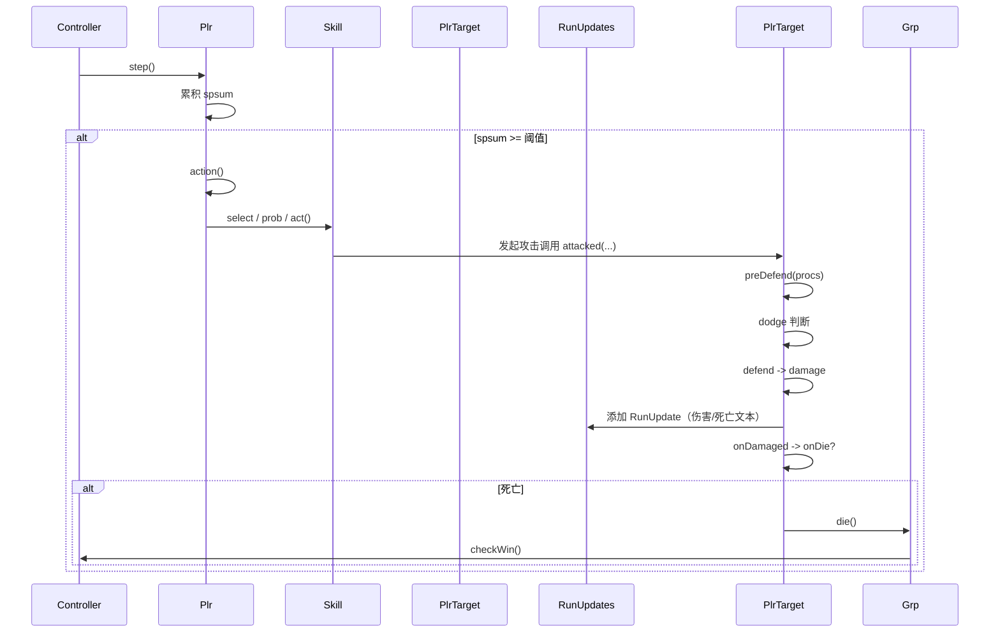

# 项目架构文档（面向重写者）—— 技术与架构视角

说明与目标
- 面向想要重写该项目但不熟悉原实现的开发者。
- 采用渐进式编写：先整体扫一遍，再逐点深入，最后钻到 `Plr`（角色）相关类/函数的实现细节。
- 重点在技术/架构与调用时序，不讨论部署/运行/构建。已知部分代码被删除，文档不尝试恢复已删除代码。
- 可忽略 `rc4.dart`、UI/交互的细节（不重要）。

---

## 1. 整体架构概览（扫一遍）

核心概念与职责
- 战斗域模型：战斗（Fgt）、队伍（Grp）、单位/角色（Plr）、技能（Skill / ActionSkl）、武器（Weapon）、事件/更新（RunUpdate / RunUpdates）、随机/PRNG（R / RC4）。
- 运行时以“步进（step）”为驱动：每个 `Plr` 会累积行动点（spsum）并触发 `action()`；行动引发技能选择、目标选择、攻击、防御、伤害、死亡等一系列处理并产生日志（RunUpdate）。
- 扩展点基于若干“Entry 列表”（例如 `predefends`、`preactions`、`postactions` 等），技能/武器/其它模块通过在这些列表中注册对象来插入行为。

代码分布（关键文件/目录）
- 根文件（核心逻辑）：`plr.dart`, `skl.dart`, `grp.dart`, `misc.dart`, `fgt.dart`, `proc.dart`
- 技能实现：`skl/*.dart`, `act/*.dart`
- 武器实现：`weapon/*.dart`
- 其他工具：`alg.dart`, `helper.dart`, `loader*`, `html/*`（前端渲染）

快速定位入口（示例）
- `Plr`：核心战斗单位（详见）
```D:\githubs\namer\namer-src\plr.dart#L1-400
```
- `Skill` 与 `ActionSkl`（选择/评分/执行）
```D:\githubs\namer\namer-src\skl.dart#L1-160
```
- 事件输出（RunUpdate / RunUpdates）
```D:\githubs\namer\namer-src\misc.dart#L1-140
```
- 队伍管理（Grp）
```D:\githubs\namer\namer-src\grp.dart#L1-200
```
- 武器（factory、init、upgrade 钩子）
```D:\githubs\namer\namer-src\weapon\weapon.dart#L1-220
```

---

## 2. 模块说明（职责与交互）

2.1 Plr（单位 / 角色）
- 职责：储存属性、技能和事件列表；实现行动决策与执行（step -> action）；伤害/防御/死亡处理；和 `Grp` / `Weapon` / `Skill` 交互。
- 重要职责点：构建/升级（buildAsync）、属性计算（initValues/updateStates）、行为驱动（step/action）、伤害链（attacked -> defend -> damage -> onDamaged -> onDie）。
- 关键字段与扩展点（事件列表）：`updatestates`, `presteps`, `preactions`, `postactions`, `predefends`, `postdefends`, `postdamages`, `dies`, `kills`（它们是模块化插入逻辑的基础）。
- 参考（定位用）：
```D:\githubs\namer\namer-src\plr.dart#L1-140
```
```D:\githubs\namer\namer-src\plr.dart#L200-360
```

2.2 Skill（技能系统）
- 抽象层次：`Skill`（被动/通用）与 `ActionSkl`（主动技能，带 `act` 方法）。
- `select` / `scoreTarget` 机制用于 AI 目标选择：基于“智能”模式和目标评分来排序选择目标。
- 被动能力通过 `addToProcs()` 将行为挂到 `Plr` 的那些 Entry 列表上，主动技能通过 `actions` 列表被挑选执行。
- 参考：
```D:\githubs\namer\namer-src\skl.dart#L1-160
```

2.3 Grp（队伍）
- 管理队伍成员（initPlayers、players、alives、dispPlayers），处理添加随从、死亡通知与胜利判定。
- 与 Fgt（战斗控制器）耦合，用于全局成员管理与胜利检查。
- 参考：
```D:\githubs\namer\namer-src\grp.dart#L1-200
```

2.4 RunUpdate / RunUpdates（事件日志）
- 负责收集战斗过程中产生的文本/状态变更事件（RunUpdate），供前端或日志系统渲染。
- `Plr.damage()`、`onDie()` 等处会 push `RunUpdate` 实例到 `RunUpdates`。
- 参考：
```D:\githubs\namer\namer-src\misc.dart#L1-140
```

2.5 Weapon（武器）
- Weapon 有 factory，用来根据名称返回不同子类（特殊武器、Boss 武器、默认武器）。
- Weapon 在 `init` 时使用 PRNG 解码内部数组（ss），并在 `preUpgrade`/`postUpgrade` 钩子里影响 `Plr` 的属性与技能等级。
- 对重写者的建议：可先实现一个简化版本（只返回常规 attrAdd 与 sklLevel），随后再实现复杂的随机解码。
- 参考：
```D:\githubs\namer\namer-src\weapon\weapon.dart#L1-220
```

---

## 3. Plr 相关详解（字段与关键函数，便于重写复现行为）

下面以“字段 → 生命周期 → 行为 → 技能选择 → 扩展点”的顺序逐条解析。

3.1 重要状态字段（摘要）
- 身份/显示：`baseName`, `clanName`, `sglName`, `idName`, `fullName`, `dispName`
- 属性：`atk, def, spd, agl, mag, mdf, itl, hp, maxhp, mp`
- 计算/原始数组：`attr`（经过计算后的属性数组），`ss0/ss/sglss`（原始解码数据，用于升级/技能/武器）
- 技能/动作容器：`skills`, `sortedSkills`, `actions`, `dftAct`
- 扩展点列表：见上文（多个 MList）

字段声明位置：
```D:\githubs\namer\namer-src\plr.dart#L1-120
```

3.2 生命周期（构建到运行）
- 构建/升级：`buildAsync()` 调用 `weapon.preUpgrade()`、`initRawAttr()`、`initSkills()`、`weapon.postUpgrade()`、`addSkillsToProc()`、`initValues()`。这是一条固定的初始化流水线。
```D:\githubs\namer\namer-src\plr.dart#L60-140
```
- 运行步进：`step(R r, RunUpdates updates)` 基于 `spd` 与随机数累积 `spsum`；超过阈值（2048）触发 `action()`。
```D:\githubs\namer\namer-src\plr.dart#L200-260
```
- 行动流程：`action()` 负责 MP 消耗、技能挑选（先查 `preAction`，否则在 `actions` 中按概率挑选）、目标选择、调用技能 `act()`，以及 `postAction()`。行动结束后会检查并处理需要清除的状态。
```D:\githubs\namer\namer-src\plr.dart#L260-360
```

3.3 伤害 / 防御 / 死亡流程（顺序必须保留）
- 被攻击入点：`attacked(atp, isMag, caster, ondmg, r, updates)`。它先调用 `preDefend`（允许防御型 proc 修改伤害），随后判断闪避（Alg.dodge），再调用 `defend`。
```D:\githubs\namer\namer-src\plr.dart#L320-380
```
- 防御：`defend(atp...)` 根据防御系数 `Alg.getDf` 计算实际伤害，随后调用 `damage()`。
```D:\githubs\namer\namer-src\plr.dart#L380-420
```
- 伤害应用：`damage(dmg, caster, ondmg, r, updates)` 处理 hp 变化，构建 `RunUpdate`（包含 delay/score 等），调用 `ondmg` 回调，最后触发 `onDamaged()`。
```D:\githubs\namer\namer-src\plr.dart#L420-480
```
- 死亡处理：`onDamaged()` 检测 hp，若 hp<=0 则调用 `onDie(oldhp, caster, r, updates)`；`onDie` 会发出死亡日志、调用 dies 列表里的 entry 并通知 `Grp.die(this)`。
```D:\githubs\namer\namer-src\plr.dart#L460-520
```

3.4 技能选择与评分（AI 方面）
- `Skill.select()`：会重复调用 `selectOneTarget()` 直到达到需要目标数量或超过容错次数，最后使用 `scoreTarget` 对候选目标评分并返回 `PlrScore` 排序结果。
- `Skill.scoreTargetImpl()`：在“智能”模式下会依据敌我存活数、属性和 `Alg.rateHiHp` / `Alg.rateLowHp` 等函数计算分值；否则返回随机基准值加 attract。
```D:\githubs\namer\namer-src\skl.dart#L1-160
```
- `ActionSkl.prob()`：默认使用 `r.r127 < level` 决定该技能在候选中被选中的概率（一个重要的概率模型点）。

3.5 扩展点（Entry 列表）设计要点
- 这些列表是插件式的关键：技能/武器/其它系统通过实例化特定 Entry 并加入相应列表来影响 `Plr` 行为（例如 `PreDefendEntry`, `PostActionEntry`, `DieEntry`）。
- 在重写时可以保留相同的“生命周期挂钩”概念，但建议用更通用的 Event/Listener（或 Observer）接口以提高可维护性与测试性。
- 示例用例定位（Entry 用法遍布技能/weapon 子目录，例如 `weapon/rinick_modifier.dart`）：
```D:\githubs\namer\namer-src\weapon\r inick_modifier.dart#L80-130
```

---

## 4. 典型调用序列（时序图，Mermaid）
（展示一次从 step -> action -> 技能 act -> 目标 defend -> damage -> die 的时序，便于理解事件流）


---

## 5. 关键实现要点与重写建议（面向开发者）

从零重写战斗引擎建议的最小可行步骤（按优先级）：
1. 建模核心类型：`Plr`, `Grp`, `RunUpdate/RunUpdates`, `Skill (抽象)`, `ActionSkl`。先实现它们的最小接口与数据结构。
2. 实现战斗循环：支持 `step -> action -> act -> attacked -> defend -> damage -> onDie` 的完整执行链路，并在每一步产生可断言的 `RunUpdate`（用于单元测试）。
3. 实现事件系统：把 Plr 的各种挂钩（predefend/postaction/die 等）抽象为统一事件监听接口，确保被动技能/武器可以注册监听器。
4. 实现 `Skill.select` 基础版本：先做简单的目标选择与随机评分，再根据需要还原更复杂的评分逻辑。
5. 武器先做占位实现：实现简单的 `attrAdd` 与 `sklLevel` 并提供 hook（preUpgrade/postUpgrade），复杂的 PRNG 解码可以后移。
6. 编写单元测试：对每个阶段（如伤害计算、死亡流程、技能选择概率）写明确断言的单元测试，保证重写版本行为稳定并可调。

实现细节与陷阱提示
- 初始化顺序重要：`weapon.preUpgrade()` -> `initRawAttr()` -> `initSkills()` -> `weapon.postUpgrade()` -> `addSkillsToProc()`。错误顺序会导致技能等级或属性错误。
- `addSkillsToProc()` 内部有“boost”逻辑（把某个 action 的 level *2），这个业务规则会影响战斗平衡，若要兼容原逻辑需要保留或明确替代策略。
- 事件 Entry（MList 类型）在运行时会被修改（例如删除自身），重写时注意并发修改/迭代安全。
- 评分/AI 逻辑分散在 `Skill.scoreTargetImpl` 和 `Alg` 中，若不需要精确复现，可先用更简单的启发式评分替代。

---

## 6. 代码定位索引（便于快速查阅）
- Plr 类（核心字段、行为实现）：
```D:\githubs\namer\namer-src\plr.dart#L1-520
```
- Skill 与 ActionSkl：
```D:\githubs\namer\namer-src\skl.dart#L1-160
```
- RunUpdate / RunUpdates：
```D:\githubs\namer\namer-src\misc.dart#L1-140
```
- Grp（队伍管理）：
```D:\githubs\namer\namer-src\grp.dart#L1-200
```
- Weapon（工厂 + 升级钩子）：
```D:\githubs\namer\namer-src\weapon\weapon.dart#L1-220
```

---

## 7. 下一步建议（可选任务）
- 我可以为你生成：
  - 一个最小重写骨架（接口 + 最简单实现 + 单元测试用例），或者
  - 更细的模块化文档（例如单独的 `Plr.md`、`Skill.md`、`Weapon.md`），或者
  - 基于你指定语言/框架的重写起始模板。
- 请选择你想要的下一步（例如 “生成最小骨架” 或 “先做 Plr 的单元测试” 等）。

--- 

附：简短术语表
- spsum：行动点累计器，达到阈值时触发行动。
- ActionSkl：主动技能，包含 `act(...)` 与 `prob(...)`。
- Entry 列表：可插拔的生命周期钩子（predefend、postaction 等）。
- RunUpdate：战斗中单条事件（用于文本/动画驱动）。
