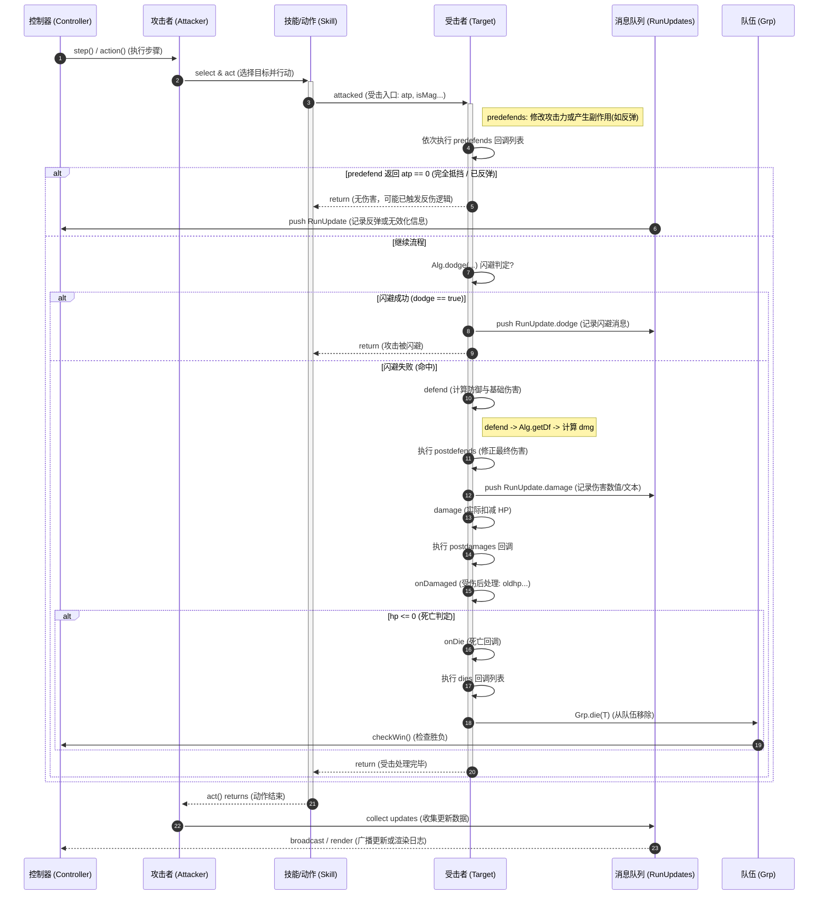

# 标准攻击时序图（Standard attack sequence）

说明：本图展示常见的攻击处理主线 —— 从单位行动触发技能，到目标被攻击、执行防御、计算伤害并处理受伤/死亡的完整调用顺序。
注意：本图仅表示“标准攻击流程”（即通过 `attacked(...)` 入口触发），不包含直接调用 `defend(...)`、直接修改 `hp`、自爆/直接 `onDie`、召唤物伤害转移等特例。那些特例请参见对应的分图文件。

