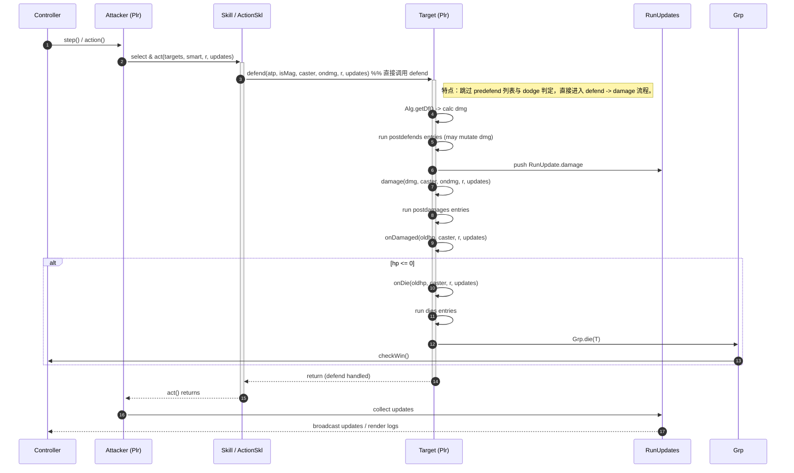

# 直接调用 defend 的时序图（Direct defend sequence）

说明：某些技能或行为会直接调用 `defend(...)`，绕过 `predefends` 与闪避（dodge）判定。此图展示在这种情况下的调用顺序与关键注意点（例如 postdefends/postdamages 的执行点）。

触发点（仓库内检索到的全部直接调用 `defend(...)` 的位置）
- 已检索并确认的调用位置（按相对路径列出）：
  - `namer-src/act/assassinate.dart` — 在潜行/背刺的第二阶段直接调用 `saveTarget.defend(...)` 以实现背刺效果（调用点见文件内实现）。（检索上下文行附近：约 L71-75）
  - `namer-src/act/disperse.dart` — `act` 在移除前置的 `Dt.shield`/`Dt.iron` 后直接调用 `target.defend(...)`，并在对 `Minion` 时加倍攻击力。 （检索上下文行附近：约 L51-57）
  - `namer-src/act/thunder.dart` — 在技能分支中直接用 `target.defend(...)` 判断命中并处理伤害（调用后用于判定 hit）。（检索上下文行附近：约 L24-28）
  - `namer-src/boss/ikaruga.dart` — 部分 Boss 技能分支直接调用 `target.defend(...)`（用于实现特殊命中/吸收逻辑）。（检索上下文行附近：约 L59-63）

附注（关于定义 vs 调用）
- `namer-src/plr.dart` 定义了 `defend(...)` 方法（即被调用的入口），这不是“调用点”而是实现点。参考实现可见于 `plr.dart` 中 `defend` 的定义处（检索上下文约 L486-493）。
- 文档中其它地方（如 `docs`）也会提到 `defend(...)` 的语义与调用顺序，但不计入“直接调用”的触发点列表。

实现与验证要点（针对这些触发点）
- 在 Rust 重写时必须保留 `defend` 作为独立可调用的 API（签名与行为应匹配 `attacked` 在跳过 `predefends` 与 dodge 时的语义）。  
- 为上面列出的每个直接 `defend` 调用点建立确定性单元测试：
  - 固定相同 seed，记录并比对 RunUpdate 序列，确认缺失 `predefends` / `dodge` 的事件与 Dart 实现一致。
  - 覆盖 Minion / 非 Minion 分支（例如 `disperse`）与技能特殊分支（例如 `assassinate` 的回避分支）。
- 注意 entry 遍历语义（postdefends、postdamages 等）在 `defend` 路径中仍然会执行——需要确保重写时调用顺序与原实现一致，且在遍历中对列表的增删语义保持相同（是否即时生效、是否快照遍历等）。
