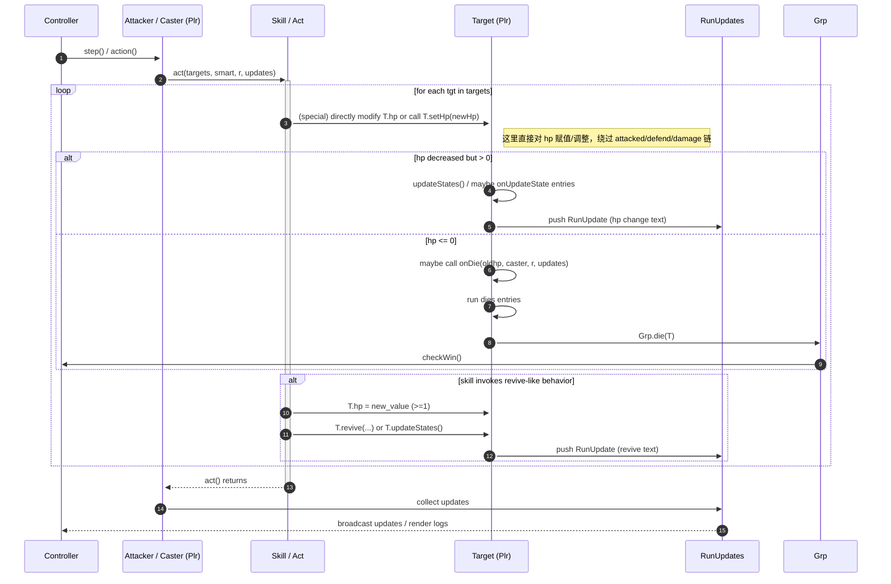

# 直接修改 HP 的时序图（Direct HP modification sequence）

说明：本图描述那些直接对目标 `hp` 进行赋值或修改的技能/行为的调用路径与后果。此类行为会绕过常规的 `attacked -> predefend -> dodge -> defend -> damage` 链，因此在重写时必须显式识别并保留相应路径与副作用（例如是否触发 `dies` / `onDie` / `revive` 等）。

下面列举典型触发点（非穷举）：
- `act/revive.dart`（复活类直接赋值 hp）
- `act/clone.dart`（复制/生成新单位）
- `act/half.dart`（将 hp 置为一半或直接调整）
- 某些 skill（例如 `skl/reraise.dart`）在死亡/复活逻辑中直接修改 hp

用途：此文档用于帮助在 Rust 重写中把“直接改 HP”路径单独测试，确保不会错漏掉应触发的 `dies` / `onDie` / `revive` 行为。

实现与验证要点（短摘）
- 明确列出并标注源码中所有“直接修改 hp”的调用点（文件与行号），在 Rust 重写中要在对应位置保留“直接改 hp”的语义。
- 这些调用点不应进入 `attacked()` 路径——测试时需断言不会触发 `predefends`、`dodge`、`postdefends`、`postdamages` 等与攻击链相关的 entry。
- 依然需要触发 `onDie()`/`dies`：若直接赋值导致 `hp <= 0`，必须执行 `onDie(oldhp, caster, r, updates)` 并走 `dies` 与 `Grp.die()` 流程，除非技能明确以其它方式处理（例如立即复活）。
- 若技能在直接改 hp 后显式调用 `onDie` 或 `revive`，需在文档/测试中记录该行为并按相同顺序在重写中实现。
- 测试建议：
  - 场景 A：直接将 hp 设为非零的降低值，验证不会触发攻击链的 entry，但会产生 hp 变更的 RunUpdate。
  - 场景 B：直接将 hp 设为 0（或负），验证立即触发 `onDie` 且 `dies` 条目按原有注册顺序执行。
  - 场景 C：直接改 hp 后再调用 `revive`（或 reraise 触发）——验证最终 hp 与复活日志一致，且没有重复触发死亡处理。
- 在 Rust 中实现时，建议把“直接改 hp”的调用点作为明确 API（例如 `Plr::set_hp_direct(...)` 或 `Plr::modify_hp_direct(...)`），并在 API 文档中标注其与 `attacked/defend` 语义的差别，以免误用。

参考（示例代码位置）
- `namer-src/act/revive.dart` — 复活 / 直接修改 hp 的实现（查看文件以确认行号）
- `namer-src/act/clone.dart` — 生成新单位并直接设置其 hp
- `namer-src/skl/reraise.dart` — 死亡时复活逻辑（在 `dies` 列表中注册）
