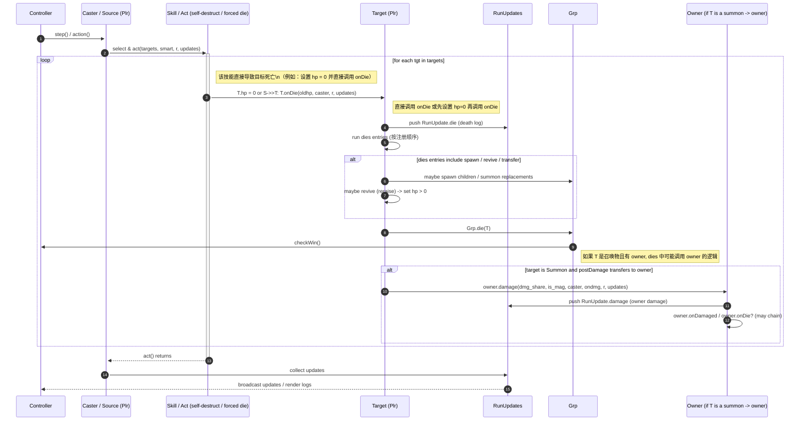

# 直接调用 onDie 的时序图（Direct onDie / self-destruct sequence）

说明：
- 本图专门描述那些直接把目标置为死亡（或直接调用 `onDie(...)`）的技能/行为的执行路径与副作用。与标准攻击链不同，这类行为绕过常规的 `attacked -> predefend -> dodge -> defend -> damage` 流，直接进入死亡处理（包括 `dies` 列表、`Grp.die()`、以及可能的复活/分裂逻辑）。
- 典型触发点（示例，但非穷举）：`act/shadow.dart`（幻影自爆）、`act/summon.dart` 中的自爆技能（SklExplode）、某些特殊技能或道具效果强制调用 `onDie`。

用途：
- 在 Rust 重写时，需要把这些直接调用 `onDie` 的路径单独测试，确保死亡相关的 Entry（`dies` / `kills` 等）在相同时机、相同顺序被调用，且不会误触发攻击链上的 entry（如 `predefends` / `postdamages` 等，除非技能明确触发）。

实现与验证要点（简短）
- 明确列出所有源码中“直接调用 `onDie`”或“直接把 hp 置 0 并触发死亡”的位置（文件 + 行号），在重写时逐一映射为相应的 Rust 调用点。
- 确保在直接调用 `onDie` 时：
  - 立刻执行 `dies` 列表（按注册顺序），并允许这些 entry 做出诸如复活、生成子体、通知 owner 等副作用。
  - 调用 `Grp.die(this)` 以更新队伍状态并触发胜负检测。
  - 若 `dies` 中有对其它 Plr 的调用（例如生成幻影、召唤子体、调用 owner.damage），这些跨对象调用的顺序与副作用必须与原实现一致。
- 测试建议：
  - 场景 A：技能直接调用 onDie 并无复活 -> 验证 `dies` 顺序与 `Grp.die` 时间点。
  - 场景 B：dies 中触发生成子体（分裂） -> 验证新单位被加入队伍且事件顺序一致。
  - 场景 C：召唤物自爆并对 owner 造成伤害 -> 验证 owner 的 `damage/onDamaged/onDie` 链在召唤物自爆时被正确触发，并比较 RunUpdate 序列。
- 在 Rust 实现中，建议把“直接触发死亡”的操作封装为明确 API（例如 `Plr::force_die(oldhp, killer, r, updates)` 或 `Plr::die_now(...)`），并在 API 文档中标注其与 `damage()` / `attacked()` 的区别，避免误用或重复触发死亡处理。

参考（检查点）
- 在代码审查/迁移时，请把以下动作作为必须检查与测试的节点：
  - 是否列出并映射每个直接调用 `onDie` 的位置？
  - 是否测试了 `dies` 列表中可能产生的跨对象副作用（spawn/revive/owner.damage）？
  - 是否保证在直接触发死亡路径中不会错误地触发经过 `attacked()` 的额外挂钩（predefend/dodge/postdefends/postdamages），除非源代码明确这么做？