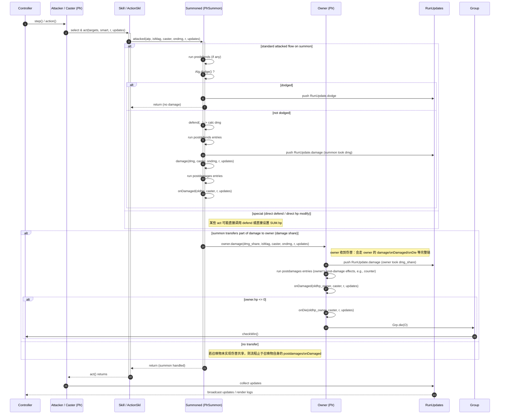

# 召唤物伤害共享时序图（Summon damage share sequence）

说明：
- 描述召唤物（Summon / PlrSummon）被攻击后如何把部分伤害转移到其 `owner`（召唤者）上的调用链。
- 此类行为在仓库中典型实现为 `PlrSummon.postDamage()`（参见 `namer-src/act/summon.dart`），它在召唤物的 `postdamages` 或 `onPostDamage` 中调用 `owner.damage(dmg ~/ 2, ...)`（或类似逻辑），从而在召唤物受伤时触发 owner 的 `damage/onDamaged/onDie` 流程。
- 在重写为 Rust 时，必须保证跨对象调用顺序与 RNG / entry 遍历语义一致，避免借用冲突或事件顺序错乱。

用途：
- 帮助重写者理解并单独测试召唤物 -> owner 的跨对象伤害链，确保 owner 的 `postdamages` / `onDamaged` / `dies` 等按原实现时序执行。

实现与验证要点：
- 明确源码中所有把伤害转给 owner 的位置（例如 `namer-src/act/summon.dart` 中 `postdamages.add(onPostDamage)` 或 `PlrSummon.postDamage()` 的实现），并将每个位置记录为行号清单的一项。
- 在 Rust 中实现跨对象调用时，建议使用 `Rc<RefCell<Plr>>`（单线程）模式或相应的可变共享策略，避免在跨对象调用中长时间持有可变引用导致借用冲突。
- 验证行为时需检查：
  - 召唤物受到伤害时，是否按顺序产生召唤物的 damage RunUpdate，然后产生 owner 的 damage RunUpdate（顺序必须与 Dart 相同）；
  - owner 的 `postdamages`、`onDamaged`、`onDie` 是否在 owner 被转移伤害后正确触发；
  - 若 owner 的 `onDamaged` 或 `onDie` 又触发了对召唤物或其它单位的调用（例如生成幻影、复活、反击），这些递归/链式调用的顺序要与原实现一致。
- 测试建议：
  - 用固定 seed 构造场景：召唤物存在、被敌方技能击中并在 `postDamage` 中向 owner 转移一半伤害。比较 Dart 与 Rust 的 RunUpdates 序列（summon damage -> owner damage -> owner onDamaged/onDie -> 可能的 owner postdamages）。
  - 覆盖 owner 死亡情形：召唤物的伤害共享是否能导致 owner 死亡，并验证 `dies` 列表与 `Grp.die()` 在正确时间点被调用。

参考（示例文件）：
- `namer-src/act/summon.dart` — 召唤物实现与 `postdamages` 注册点（检查 `PlrSummon.postDamage()` 的实现与调用）。
- `namer-src/plr.dart` — `damage`、`onDamaged`、`onDie` 的实现（用于比对调用顺序与 RunUpdate 生成点）。

注意：
- 召唤物与 owner 之间的伤害共享会改变事件的发生顺序与写入目标（owner.hp、召唤物.hp），因此在重写时务必把这些路径单独列为测试用例并确保 RNG 与 entry 注册点完全一致。