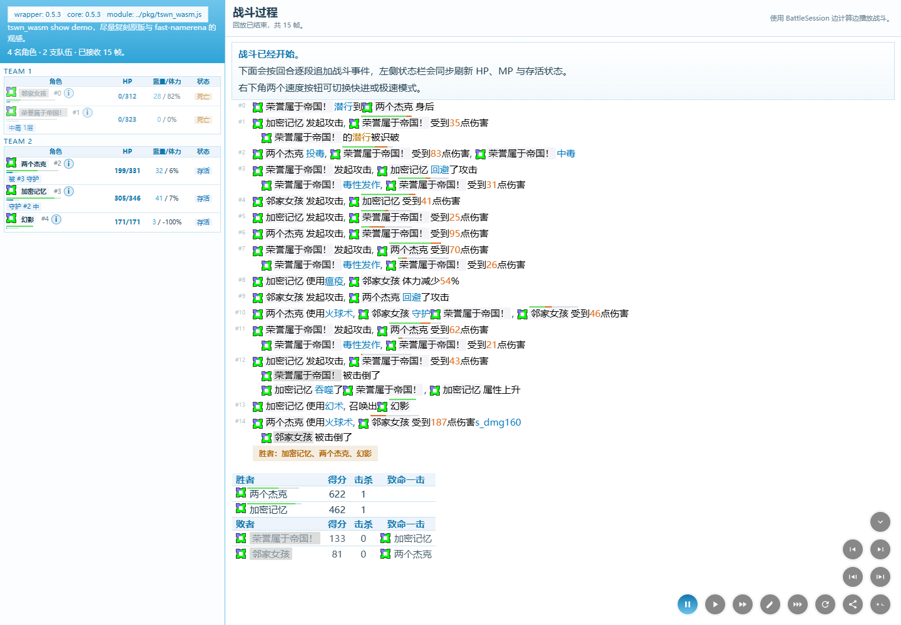

# Web streaming 性能基线

2026-09-08，正式流式页面与 release WASM。代码基于 `0089798c`（网页行为修正后），本轮结果用于 BattleSession 重构验收。

## 环境与采样方式

- Windows 10 22H2（10.0.19045），AMD Ryzen 7 5800X。
- Microsoft Edge 152.0.4191.62，独立 headless 浏览器上下文，1440 × 1000 viewport。
- `cargo build -p tswn_wasm --target wasm32-unknown-unknown --release`，`wasm-bindgen 0.2.127 --target web`；包含 release 默认的调试信息，未额外 wasm-opt。
- 通过 localhost 静态服务加载真实 `index.html`、页面 JS、CSS 和 WASM。模块在页面初始化时加载并复用，每次重新创建 BattleSession / 图标缓存，使用 turbo 完整播放。
- 固定四组输入，各连续运行 20 次；不丢弃首个 session 的 JIT 开销。20 次都使用同一个固定输入及其 seed 语义，不修改 frozen corpus。
- TTIS / TTFE 从调用与开始按钮相同的 `startBattle` 路径计时，到 initial DOM 完成 / 第一个可见 clip 插入。属于 DOM 完成指标，不是像素呈现时间；不包含打开页面时的网络下载。
- next_frame 包含同步 WASM 推进、serde_wasm_bindgen DTO 转换和 terminal result 复制；不包含图标生成、昵称派生和 DOM。render chunk 包含插入 DOM、滚动布局与 sidebar 更新。
- TTIS / TTFE 的 p50、p95 按 20 次对局计算；next_frame 和 render 按该类全部调用样本合并计算，使用 nearest-rank 分位数。帧数和 chunk 数为每场固定数量。

## 实测结果

单位均为 ms。

| fixture | TTIS p50 / p95 | TTFE p50 / p95 | next_frame p50 / p95 / max | render chunk p50 / p95 | frames | chunks |
| --- | ---: | ---: | ---: | ---: | ---: | ---: |
| 1v1 | 2.300 / 3.000 | 3.000 / 4.200 | 0.200 / 0.400 / 4.200 | 0.600 / 1.100 | 10 | 28 |
| 2v2 | 3.000 / 4.700 | 3.800 / 6.100 | 0.200 / 0.400 / 0.900 | 0.700 / 1.200 | 15 | 43 |
| ffa_8 | 5.500 / 7.700 | 6.400 / 9.000 | 0.300 / 0.700 / 2.600 | 1.300 / 2.100 | 45 | 109 |
| 3v3v3 | 5.400 / 8.100 | 6.600 / 9.700 | 0.300 / 0.600 / 2.300 | 1.200 / 2.000 | 57 | 119 |

四组 next_frame WASM + DTO p95 均小于 16.7 ms；最高为 ffa_8 的 0.7 ms。本环境不需要将计算迁入 Worker。该结果不代表移动端或首次网络加载性能。

本次首次 1v1 session 的 TTIS / TTFE 为 24.300 / 32.500 ms，已计入上述分位数；其影响主要出现在第一场初始化/JIT。

结构性验收：initial DOM 在第一次 next_frame 前完成；开始 playback 前最多接收两帧；页面没有完整 battle_replay 调用。fake source 页面测试进一步覆盖暂停后最多完成一次已发起 pull、历史续播、单帧需求、generation 隔离、异常保留历史与 turbo 每 24 个可见 chunk yield。

## 固定输入

位于 `crates/tswn_test/cases/runtime_stress/`：

- `1v1-0f92cb76cc37fdc5.txt`
- `2v2-554f4128af707167.txt`
- `ffa_8-16d11de1ebe1df41.txt`
- `3v3v3-0ace5df17b84e26a.txt`

## 复现

在仓库根目录执行：

```powershell
npm install --prefix target/web-test-tools --no-audit --no-fund playwright linkedom
cargo build -p tswn_wasm --target wasm32-unknown-unknown --release
wasm-bindgen target/wasm32-unknown-unknown/release/tswn_wasm.wasm --target web --out-dir target/web_streaming/pkg
node scripts/benchmark_web_streaming.mjs
```

默认使用 Windows 的 Edge 安装路径；可用 `TSWN_BROWSER_PATH` 指定独立测试浏览器。其他系统使用 Playwright Chromium，需要先安装对应浏览器。测试进程启动 localhost server 与独立浏览器，在 finally 中关闭，不读取用户浏览器 profile。

输出：`target/web_streaming/baseline.json`（环境、80 次数据、逐次调用样本）、`baseline_table.md`、`streaming_result.png`。JSON 仅包含 fixture 标签和数字，不包含对局输入内容。正常页面 `?perf=1` 在战斗播放结束时使用 `console.table` 打印统计；默认不显示性能面板。

页面行为测试：

```powershell
node --test crates/tswn_wasm/examples/show-*.test.mjs
node --experimental-vm-modules scripts/verify_web_playback.mjs
```

真实跨语言 payload 对比（先生成 Python import tree、debug C/CLI 和 Node WASM 包）：

```powershell
python scripts/verify_py_cli_api.py
cargo build -p tswn_capi
cargo build -p tswn_core --bin tswn-cli
cargo build -p tswn_wasm --target wasm32-unknown-unknown
wasm-bindgen target/wasm32-unknown-unknown/debug/tswn_wasm.wasm --target nodejs --out-dir target/battle_wasm_node
python scripts/verify_battle_cross_binding.py
```

## 页面截图

2v2 完整播放后的界面，包含动态实体与结果统计：


