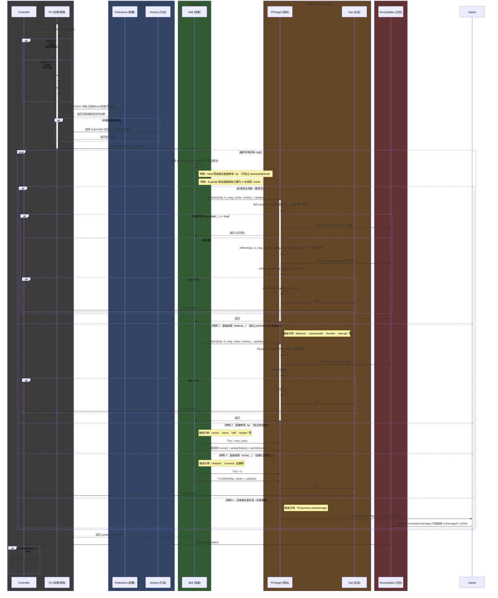

# Rust 重写设计文档（面向无差异行为复现）

作者：由原项目代码分析得到的架构映射建议  
目标读者：要用 Rust 重写该项目的开发者（希望在行为上与原 Dart 实现一致）

说明与约束（概要）
- 目标是“行为等价”（不追求字面实现一致）；必须在战斗循环、技能选取、伤害计算、事件顺序、随机数序列等方面复现原实现的语义与副作用顺序。
- 原项目大量使用可插拔的 Entry 列表（例如：`predefends`、`preactions`、`postactions`、`postdefends`、`postdamages`、`dies`、`kills` 等）。在重写时必须保留这些扩展点并严格保持调用顺序。
- 原实现使用 RC4-based PRNG（`R` / `rc4.dart`），在 Rust 中建议移植或提供等价的可控 PRNG，以保证 deterministic 行为。
- 保持单线程模型（与原实现一致），避免并发引入的行为差异。

总体策略（高层）
- 将类映射为 `struct` + `impl`，接口/抽象类映射为 `trait`。多态对象使用 trait objects（`Box<dyn Trait>`）或泛型。
- 对于共享可变对象（Plr 在组/技能/weapon 之间的引用），建议在 Rust 中使用 `Rc<RefCell<T>>` + `Weak`。
- Entry 列表（各类 proc）建模为 trait，保留按顺序调用的语义。若 entry 需要自移除，设计返回值或由 owner 提供 unregister。
- 严格保留原有初始化顺序（weapon.pre_upgrade -> init_raw_attr -> init_lists -> init_skills -> weapon.post_upgrade -> add_skills_to_proc -> init_values），因为这会影响属性/技能的最终值与 boost 行为。

重要观察（在代码检查中发现的“分支/特例”）
在把图与实现对齐时，必须注意下列在代码中实际存在并改变属性访问顺序的分支（我已在代码库中确认这些分支）：

1. 标准攻击流程（多数情况）
   attacked() -> preDefend entries -> dodge 判断 -> defend() -> damage() -> onDamaged() -> onDie()（如需）
   - 在这个流程中，`predefends` 能修改 atp（或直接返回 0 表示完全抵挡），`dodge` 层负责闪避判定，`postdefends` 在 defend/damage 后可能进一步修改伤害或效果，`postdamages` 在伤害生效后运行。

2. 特例：直接调用 `defend(...)`（跳过 preDefend 与 dodge）
   - 触发示例（在代码中有明确实现）：`act/disperse.dart`、`act/assassinate.dart`、`act/thunder.dart`、`boss/ikaruga.dart` 等。
   - 影响：`predefends` 不会被执行，`dodge` 判定不会发生，目标直接进入 `defend` -> `damage` 路径，导致命中与伤害计算不同。

3. 特例：直接修改 `hp`（绕过 attacked/defend 流程）
   - 触发示例：`act/revive.dart`、`act/clone.dart`、`act/half.dart`、`skl/reraise.dart` 等。
   - 影响：不触发 `predefend`/`dodge`/`postdamages` 等对攻击处理路径的挂钩；仍可能触发 `revive`/`onDie`/`dies` 的相关逻辑（取决于实现）。

4. 特例：直接调用 `onDie(...)`（自爆或强制死亡）
   - 触发示例：`act/shadow.dart`, `act/summon.dart`（自爆技能 SklExplode）等。
   - 影响：直接进入死亡处理（死亡日志、`dies` 列表、`Grp.die()`），并绕过伤害计算链。

5. 特例：召唤物伤害共享 / 伤害转移
   - 触发示例：`act/summon.dart` 中的 `PlrSummon.postDamage()`，它会调用 `owner.damage(dmg ~/ 2, ...)`。
   - 影响：当召唤物受伤时，会隐式触发 owner 的 `damage`/`onDamaged`/`onDie` 流程，导致跨对象的属性写入顺序与日志插入顺序变化。

基于以上观察，我已把 Mermaid 时序图更新为包含这些分支（如下），并在文档下方补充了基于代码检索的“模块 -> 注册到 owner 的 proc 列表”，便于重写时参考哪些模块会在何时访问/修改属性。

更新后的 Mermaid 时序图（包含所有发现的分支）

模块化 Proc 注册清单（基于代码库检索结果）
说明：下列清单来自对仓库中 `addToProcs()`、`owner.<list>.add(...)` 等用法的代码搜索与阅读。仅列出在实现中直接把 proc/回调注册到 `Plr` 上的模块（即会在运行时向 `Plr` 的 entry 列表添加项的技能/weapon/boss）。此清单用于在 Rust 重写时明确哪些模块会向哪些生命周期点插入逻辑，从而知道会在何时读取/修改属性。

格式： 文件路径 —— 注册到 owner 的哪些 entry 列表（备注 / 行为简述）

- skl（技能）目录
  - `namer-src/skl/reflect.dart` — `owner.predefends.add(this)`（PreDefend：可能反弹伤害并直接调用 caster.attacked，因此会在被攻击时访问 caster/target）
  - `namer-src/skl/counter.dart` — `owner.postdamages.add(this)`（PostDamage：在被攻击后可能注册延迟反击）
  - `namer-src/skl/defend.dart` — `owner.postdefends.add(this)`（PostDefend：在 defend 后修改伤害，如减半）
  - `namer-src/skl/hide.dart` — `owner.postdamages.add(this)`、`owner.preactions.add(this.onPreAction)`（PostDamage / PreAction：隐匿/反击/状态相关）
  - `namer-src/skl/upgrade.dart` — `owner.postdamages.add(this)`、`owner.updatestates.add(...)`（PostDamage / UpdateState）
  - `namer-src/skl/protect.dart` — `owner.postactions.add(this)`（PostAction：保护队友相关）
  - `namer-src/skl/reraise.dart` — `owner.dies.add(this)`（DieEntry：复活效果，在死亡时触发）
  - `namer-src/skl/shield.dart` — 在某些分支中 `owner.postdefends.add(shieldState)` 和 `owner.preactions.add(this)`（Shield 状态注册防御与 preaction）
  - `namer-src/skl/merge.dart` — `owner.kills.add(this)`（KillEntry：处理击杀后的合并/成长）
  - `namer-src/skl/*`（其他技能） — 若源码中含 `addToProcs()` 会把本技能注册到各种 entry（见具体文件）

- act（主动技能 / 技能动作）目录
  - `namer-src/act/assassinate.dart` — `owner.preactions.add(onPreAction)`、`owner.postdamages.add(onPostDamge)`（潜行/背刺两阶段：第一阶段注册 preaction 或 postdamage）
  - `namer-src/act/charge.dart` — `owner.postactions.add(onPostAction)`、`owner.updatestates.add(onUpdateState)`（蓄力：注册后置行为和状态更新）
  - `namer-src/act/iron.dart` — `owner.postdefends.add(onPostDefend)`、`owner.postactions.add(onPostAction)`、`owner.updatestates.add(onUpdateState)`（铁壁：postdefend 修改伤害）
  - `namer-src/act/shadow.dart` — `owner.dies.add(shadow.onOwnerDie)`（制造幻影 / 关联在 owner 死亡时触发）
  - `namer-src/act/summon.dart` — `owner.dies.add(summoned.onOwnerDie)`；`PlrSummon` 在 `initLists()` 中会 `postdamages.add(onPostDamage)`（召唤物实现有 postDamage，负责把伤害部分转给 owner）
  - `namer-src/act/accumulate.dart` — `owner.updatestates.add(onUpdateState)`（聚气状态）
  - `namer-src/act/*`（其他 act 文件） — 某些 act 可能直接调用 `target.defend(...)`、`target.attacked(...)` 或直接修改 hp（见各文件），但不是所有 act 会注册 proc 到 owner（仅列出确实注册的）

- boss（Boss 特殊技能）目录
  - `namer-src/boss/aokiji.dart` — `owner.postdefends.add(this)`（Boss postdefend）
  - `namer-src/boss/ikaruga.dart` — `owner.postdefends.add(this)`（Ikaruga 的吸收奇数伤害）
  - `namer-src/boss/covid.dart` — `owner.postdamages.add(this)`（后置 damage 处理）
  - `namer-src/boss/lazy.dart` — `owner.postdamages.add(this)`（后置 damage 处理）
  - `namer-src/boss/mario.dart` — `owner.dies.add(this)`（在死亡时触发的行为）
  - `namer-src/boss/saitama.dart` — `owner.postdefends.add(this.onPostDefend)`（postdefend）
  - `namer-src/boss/slime.dart` — `owner.dies.add(this)`（死后生成子体等）
  - 备注：Boss 的 `addToProcs()` 在 `boss/boss.dart` 会逐个调用技能的 `addToProcs()`，因此 boss 特性统一被注入到 owner 上。

- weapon（武器）目录
  - `namer-src/weapon/deathnote.dart` — `owner.postdamages.add(onPostDamage)`（死亡笔记武器在 postdamage 注册，用于在对方造成伤害时捕捉并记录目标）
  - `namer-src/weapon/rinick_modifier.dart` — 在 upgrade/modify 过程中，会对某些技能设置 level 并调用 `skil.addToProcs()`（即间接让 weapon 影响哪些 skill 注册了哪些 proc）
  - 其它 weapon 文件通常会在 `upgradeSkill()`/`init()` 中创建技能并加入 `p.skills` 和 `p.sortedSkills`，进而在 `add_skills_to_proc()` 阶段注册这些技能（间接影响 owner 的 proc 列表）

- 其它（框架/基础）
  - `namer-src/plr.dart` — 定义了 `MList<...>` 字段：`preactions`、`postactions`、`predefends`、`postdefends`、`postdamages`、`dies` 等；`addSkillsToProc()` 会遍历 `skills` 并对 `level > 0` 的技能调用 `addToProcs()`。
  - `namer-src/proc.dart` — 定义了 Entry 抽象类型（`PreDefendEntry`、`PostDamageEntry`、`DieEntry` 等），并提供 `*Impl` 封装，供技能/weapon/boss 创建具体 proc 并注册。

使用建议（给 Rust 重写时的具体建议）
- 在 Rust 中明确 `Plr` 的每个 entry 列表类型为 Vec<Box<dyn Trait>>，并保证按原顺序调用（实现可能需要 temp-queue 来在遍历过程中安全地 unregister）。
- 在实现 `Plr::attacked` 时保留两个入口：
  - 标准入口 `attacked(...)`：会先调用 `predefends` -> dodge -> `defend` -> `damage` -> `postdamages` -> `onDamaged` -> `onDie`。
  - 直接 `defend(...)` 的可用入口（由某些技能直接调用），其语义应与 `attacked` 在跳过 `predefends` 和 `dodge` 后的行为一致（包括调用 `postdefends`、`postdamages`、`onDamaged`、`onDie`）。
- 对于直接修改 `hp` 或直接调用 `onDie` 的技能，要在文档中明确记录这些技能，以便在 Rust 实现中为这些路径写单元测试和明确注释。
- 在重写 RNG 时务必保证序列消费次数与原实现一致（RC4 状态迁移、r3/r63/r127 等方法），因为任何轻微差异都会导致行为分叉。
- 将“模块 -> 注册点清单”作为权威清单保存在 docs（本节），并在代码改动时同步更新该清单。
